<div align="center">



</div>

---

## 👨‍💻 About Me

```python
class Developer:
    def __init__(self):
        self.name = "Sudhansu S. Sarangi"
        self.education = "B.Tech CSE (Sophomore)"
        self.focus = "Full-Stack Web Development"
        self.passion = "Data Structures & Algorithms"
        
    def get_motto(self):
        return "Learn • Build • Improve • Repeat 🚀"

if __name__ == '__main__':
    me = Developer()
```

---

## 🛠️ Tech Stack

<div align="center">
  <table width="900">
    <thead>
      <tr>
        <th align="center" width="450">💻 Languages & Frameworks</th>
        <th align="center" width="450">🔧 Tools</th>
      </tr>
    </thead>
    <tbody>
      <tr>
        <td align="center" valign="top">
          <h4>Languages</h4>
          <p>
            
          </p>
          <h4>Currently Learning</h4>
          <p>
            
          </p>
          <h4>Planning to Learn</h4>
          <p>
            
          </p>
        </td>
        <td align="center" valign="top">
          <h4>Tools</h4>
          <p>
            
          </p>
          <h4>Currently Learning</h4>
          <p>
            
          </p>
          <h4>Planning to Learn</h4>
          <p>
            
          </p>
        </td>
      </tr>
    </tbody>
  </table>
</div>

---

## Stats
<p align="center">
  <a href="https://github.com/umesh2341">
    
  </a>
</p>

---

## 📈 Contribution Graph


---

## 📚 Currently Working On

- 🌱 Learning Full-Stack Web Development
- 📘 Practicing Data Structures & Algorithms in Java
- 💡 Building beginner-friendly projects
- 🚀 Improving problem-solving skills every day

---

# 📂 Featured Projects

> 🚧 Coming Soon...

As I continue learning, this section will include my best projects.

* 💻 Java Applications
* 🌐 Full-Stack Web Apps
* 🤖 Python Projects

---

<div align="center">

### ⭐ Thanks for visiting my profile!


*"Keep learning. Keep building. Keep growing."* 🚀

</div>
